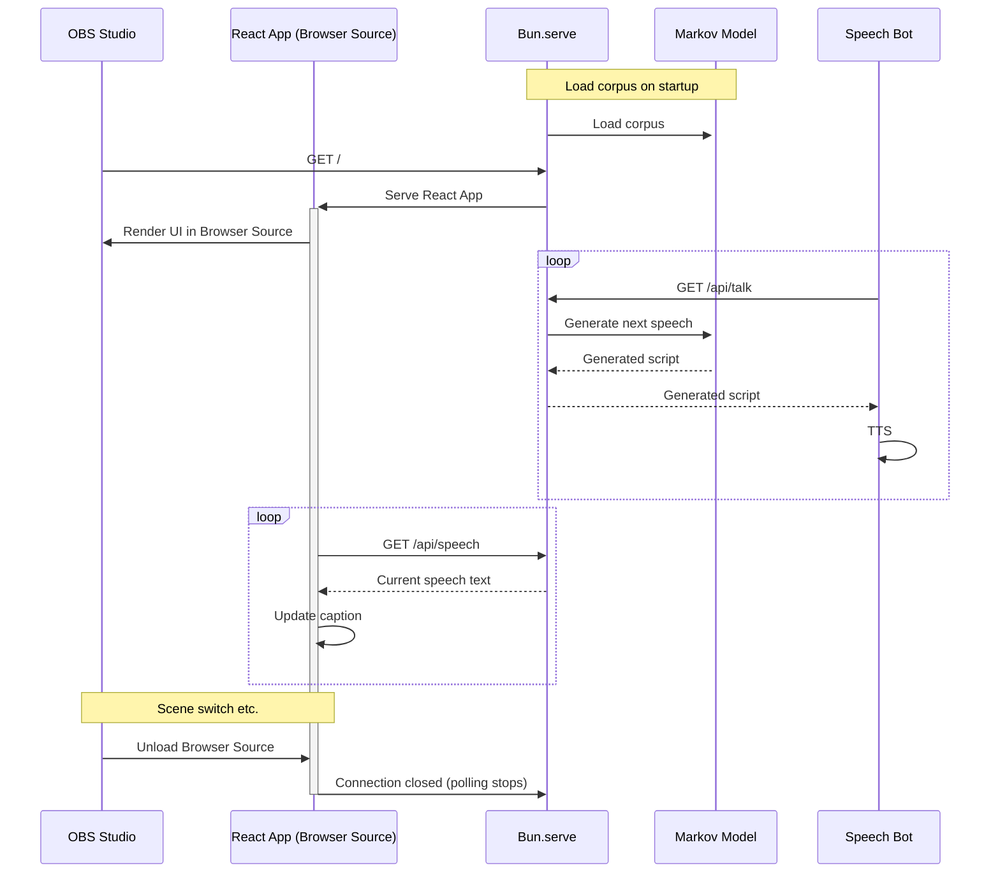

# Automated Gameplay Transmitter (WIP)

## Usage

```sh
# Start a display server
nohup bun start &>>./var/screen.log &

# Start my speaking bot
nohup ./bin/bot &>>./var/bot.log &

# Start OBS Studio
nohup ./bin/obs &>>./var/obs.log &

# Start playing Cookie Clicker (restarting periodically)
nohup sh -c 'while true ; do bun ./bin/cookieclicker.ts ; done' &>>./var/clicker.log
```

### Dependencies

This application relies on the following software.
> [!IMPORTANT]
> Please review and agree to the terms and conditions of each software before using this application.

- 配信者のためのコメントアプリ「わんコメ」https://onecomme.com

## Architecture



