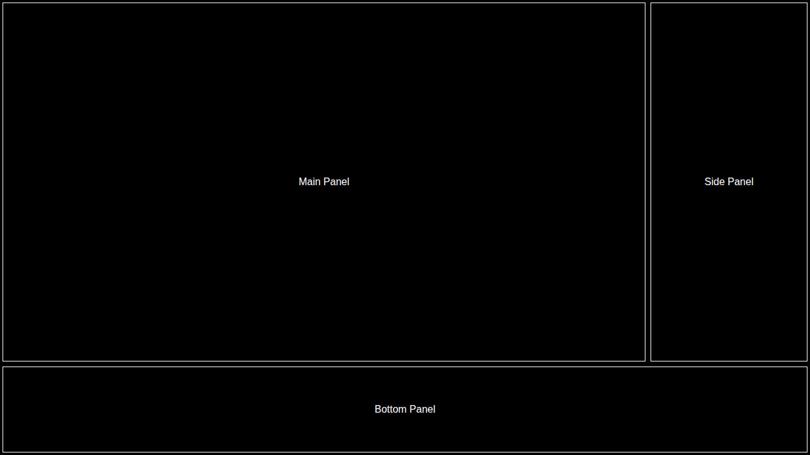

# Automated Gameplay Transmitter

This package provides a **generic automation engine** for browser‑based games and a set of
shared React components/contexts.

- **Browser and socket interfaces** (`src/lib/Browser`, `src/lib/Socket`)
- **Game modules** (e.g. `cookieclicker`) exposing state, actions and DOM scrapers
- **React UI building blocks** (`components/` and `contexts/`) for displaying stream
  information, comments, speech, etc.

## Layout Example

The `Layout` component arranges three panels — main, side, and bottom — in a 16:9 grid.
Each panel can be wrapped with a `Container` and `Box` component for a styled container.
([source](examples/App.tsx))

```tsx
import { Box, Container, Layout } from "automated-gameplay-transmitter";

export function App() {
  return (
    <Layout count={10} span={8} className="text-white">
      <Container><Box>Main Panel</Box></Container>
      <Container><Box>Side Panel</Box></Container>
      <Container><Box>Bottom Panel</Box></Container>
    </Layout>
  );
}
```



The `Box` component defaults to a black background with a white solid border.
Style props (`bgColor`, `borderColor`, `borderStyle`, `borderWidth`, `rounded`) can be used to customize the appearance:

```tsx
<Box bgColor="bg-slate-900" borderColor="border-emerald-300" borderStyle="border-double" borderWidth="border-4" rounded="rounded-xl">
  Custom styled panel
</Box>
```

