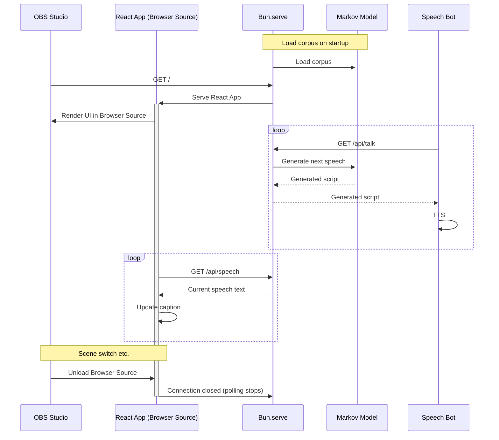

# Automated Gameplay Transmitter (WIP)

This package provides a **generic automation engine** for browser‑based games and a set of
shared React components/contexts.

- **Browser and socket interfaces** (`src/lib/Browser`, `src/lib/Socket`)
- **Game modules** (e.g. `cookieclicker`) exposing state, actions and DOM scrapers
- **React UI building blocks** (`components/` and `contexts/`) for displaying stream
  information, comments, speech, etc.

It is intended to be consumed as a dependency via a local `link:` reference in a consumer's `package.json`.

## Usage

```sh
# Start a display server
nohup bun start &>>./var/screen.log &

# Start my speaking bot
nohup ./bin/bot &>>./var/bot.log &

# Start OBS Studio
nohup ./bin/obs &>>./var/obs.log &

# Start playing Cookie Clicker (restarting periodically)
nohup sh -c 'while true ; do bun ./bin/cookieclicker.ts ; done' &>>./var/clicker.log
```

### Dependencies

This application relies on the following software.
> [!IMPORTANT]
> Please review and agree to the terms and conditions of each software before using this application.

- 配信者のためのコメントアプリ「わんコメ」https://onecomme.com

## Architecture


```mermaid
sequenceDiagram
    participant OBS as OBS Studio
    participant React as React App (Browser Source)
    participant Server as Bun.serve
    participant Markov as Markov Model
    participant Bot as Speech Bot

    Note over Server, Markov: Load corpus on startup
    Server->>+Markov: Load corpus

    %% Initialization
    OBS->>Server: GET /
    Server->>+React: Serve React App
    React->>OBS: Render UI in Browser Source

    %% TTS loop
    loop
        Bot->>Server: GET /api/talk
        Server->>Markov: Generate next speech
        Markov-->>Server: Generated script
        Server-->>Bot: Generated script
        Bot->>Bot: TTS
    end

    %% caption updating loop
    loop
        React->>Server: GET /api/speech
        Server-->>React: Current speech text
        React->>React: Update caption
    end

    Note over OBS, React: Scene switch etc.
    OBS->>React: Unload Browser Source
    React->>-Server: Connection closed (polling stops)
```

