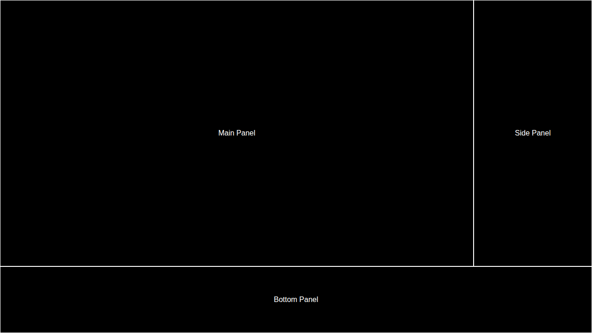

# Automated Gameplay Transmitter

This package provides a **generic automation engine** for browser‑based games and a set of
shared React components/contexts.

- **Browser and socket interfaces** (`src/lib/Browser`, `src/lib/Socket`)
- **Game modules** (e.g. `cookieclicker`) exposing state, actions and DOM scrapers
- **React UI building blocks** (`components/` and `contexts/`) for displaying stream
  information, comments, speech, etc.

## Layout Example

The `Layout` component arranges three panels — main, side, and bottom — in a 16:9 grid.
Each panel can be wrapped with a `Box` component for a styled container.

```tsx
import { Box, Layout } from "automated-gameplay-transmitter";

export function App() {
  return (
    <Layout count={10} span={8} className="text-white">
      <Box>Main Panel</Box>
      <Box>Side Panel</Box>
      <Box>Bottom Panel</Box>
    </Layout>
  );
}
```



The `Box` component defaults to a black background with a white solid border.
Style props (`bgColor`, `borderColor`, `borderStyle`, `borderWidth`, `rounded`) can be used to customize the appearance:

```tsx
<Box bgColor="bg-slate-900" borderColor="border-emerald-300" borderStyle="border-double" borderWidth="border-4" rounded="rounded-xl">
  Custom styled panel
</Box>
```

## Usage

```sh
# Start a display server
nohup bun start &>>./var/screen.log &

# Start my speaking bot
nohup ./bin/bot &>>./var/bot.log &

# Start OBS Studio
nohup ./bin/obs &>>./var/obs.log &

# Start playing Cookie Clicker (restarting periodically)
nohup sh -c 'while true ; do bun ./bin/cookieclicker.ts ; done' &>>./var/clicker.log
```

### Dependencies

This application relies on the following software.
> [!IMPORTANT]
> Please review and agree to the terms and conditions of each software before using this application.

- 配信者のためのコメントアプリ「わんコメ」https://onecomme.com

