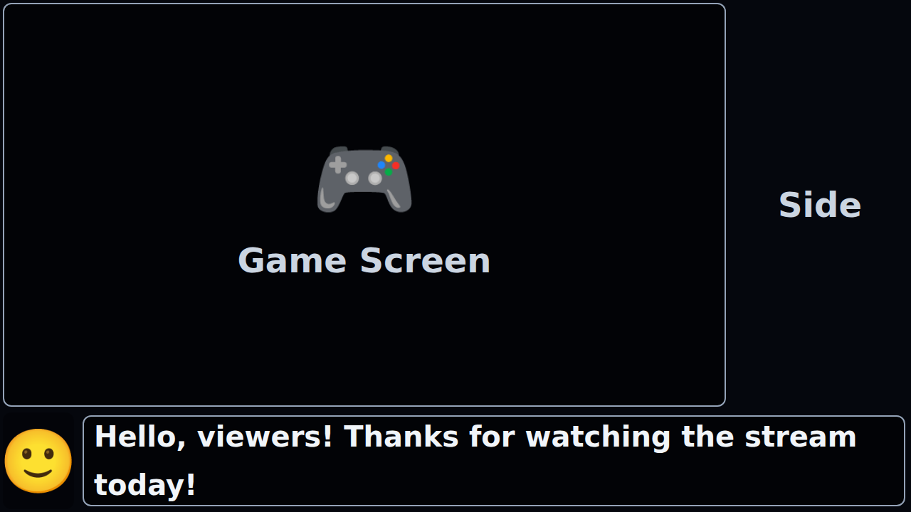

# Layout Example

This example demonstrates the three-panel stream overlay layout provided by
[automated-gameplay-transmitter](https://github.com/nahcnuj/automated-gameplay-transmitter).

## Layout

Use `<Layout count={10} span={8}>` with three `<Container>` children to produce a
10×10 grid where the main area spans 8 columns and 8 rows, the side panel takes the
remaining 2 columns, and the bottom strip spans the full width at the bottom 2 rows:



```tsx
import { Box, Container, Layout } from "automated-gameplay-transmitter";

<Layout count={10} span={8} className="...">
  {/* Main panel — col-span-8 / row-span-8 */}
  <Container>
    <Box>{/* game screen */}</Box>
  </Container>

  {/* Side panel — col-span-2 / row-span-8 */}
  <Container>
    {/* stream info */}
  </Container>

  {/* Bottom panel — col-span-10 / row-span-2 */}
  <Container>
    {/* speech / captions */}
  </Container>
</Layout>
```

| Panel | Grid area | Component |
|-------|-----------|-----------|
| Main | `col-span-8 / row-span-8` | `<Container>` + `<Box>` |
| Side | `col-span-2 / row-span-8` | `<Container>` |
| Bottom | `col-span-10 / row-span-2` | `<Container>` |

## Requirements

- [Bun](https://bun.sh) ≥ 1.1

## Getting Started

```sh
# Install dependencies (from the example directory)
bun install

# Start the development server
bun dev
```

Then open [http://localhost:3000](http://localhost:3000) in your browser.
